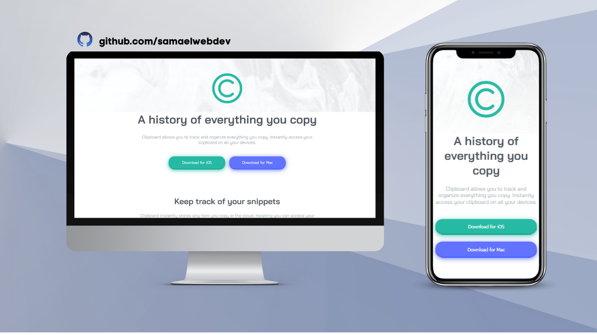
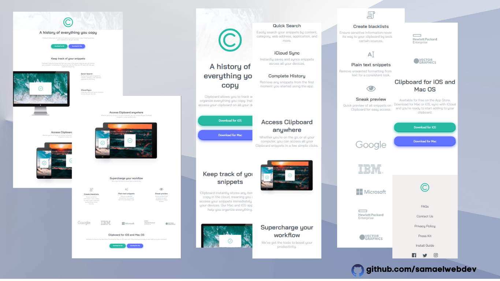

# Frontend Mentor - Clipboard landing page solution

This is a solution to the [Clipboard landing page challenge on Frontend Mentor](https://www.frontendmentor.io/challenges/clipboard-landing-page-5cc9bccd6c4c91111378ecb9). Frontend Mentor challenges help you improve your coding skills by building realistic projects. 

## Table of contents

  - [The challenge](#the-challenge)
  - [Screenshot](#screenshot)
  - [Links](#links)
- [Author](#author)

### The challenge

Users should be able to:

- View the optimal layout for the site depending on their device's screen size
- See hover states for all interactive elements on the page

### Screenshot

### Links

- Solution URL: [https://github.com/samaelwebdev/FrontEndMentor-Clipboard-Landing-Page](https://github.com/samaelwebdev/FrontEndMentor-Clipboard-Landing-Page)
- Live Site URL: [https://samaelwebdev.github.io/FrontEndMentor-Clipboard-Landing-Page/](https://samaelwebdev.github.io/FrontEndMentor-Clipboard-Landing-Page/)

### Built with

- Semantic HTML5 markup
- CSS custom properties
- Flexbox
- CSS Grid
- Mobile-first workflow
- [React](https://reactjs.org/) - JS library
- [Next.js](https://nextjs.org/) - React framework
- [Styled Components](https://styled-components.com/) - For styles

## Author

- Website - [samaelwebdev](https://github.com/samaelwebdev)
- Frontend Mentor - [SamaelWevDev](https://www.frontendmentor.io/profile/samaelwebdev)
